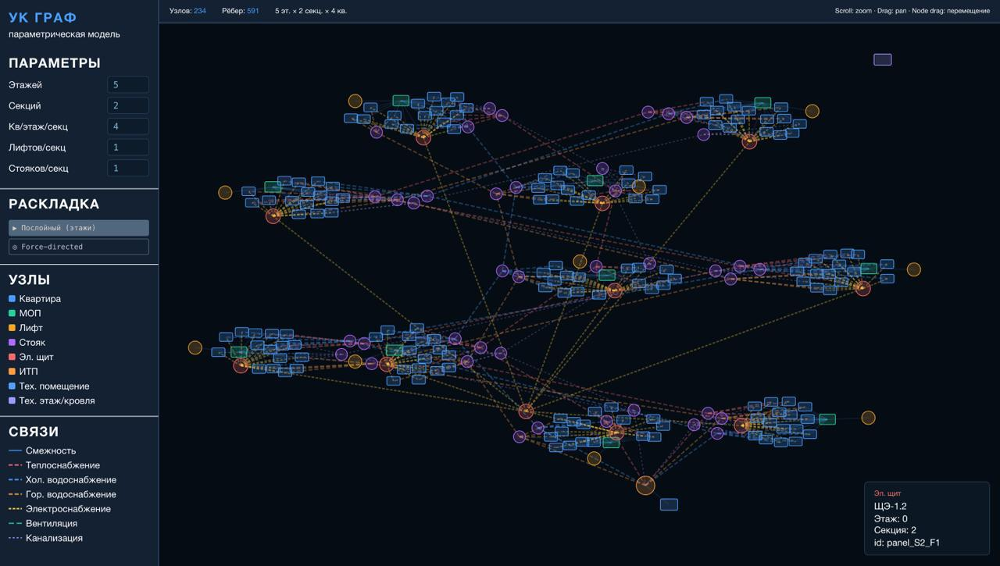

# building_maintenance_agents

### Project structure

- `house_graph` - implementation of a building representation as a graph, creating an environment.
- `server` - API implementation with a full application lifecycle (digital home generation, simulation and environment generation, RL agents).
- `client` - user visualization.

### Client



## Running

To install dependencies:

```bash
uv sync
```

The FastAPI server can be launched using Docker and Docker Compose. This method ensures a consistent environment and automatically handles dependencies.

### Prerequisites

- [Docker](https://docs.docker.com/get-docker/) and [Docker Compose](https://docs.docker.com/compose/install/) installed.
- A `.env` file inside the `server/` directory (see below).

### Environment variables

Create `server/.env` with your configuration (example):

```env
# Add your actual environment variables here
APP_NAME="Building Maintenance Agents"
DEBUG=False
```

### Using Docker container

To run container:

```bash
docker-compose up -d
```

To see logs:

```bash
docker-compose logs -f
```

To stop running container:

```bash
docker-compose down
```

### Acknowledgments

The project was supported by a grant from the Intellect Non-Commercial Foundation for the Development of Science and Education.
