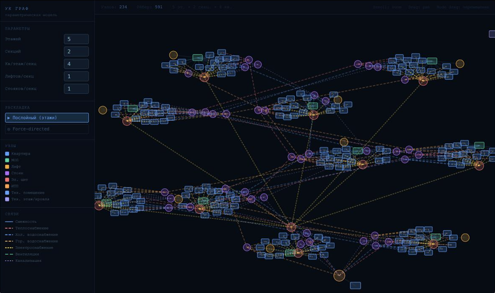

# building_maintenance_agents

### Project structure

- `house_graph` - implementation of a building representation as a graph, creating an environment.
- `client` - user visualization.

### Client

